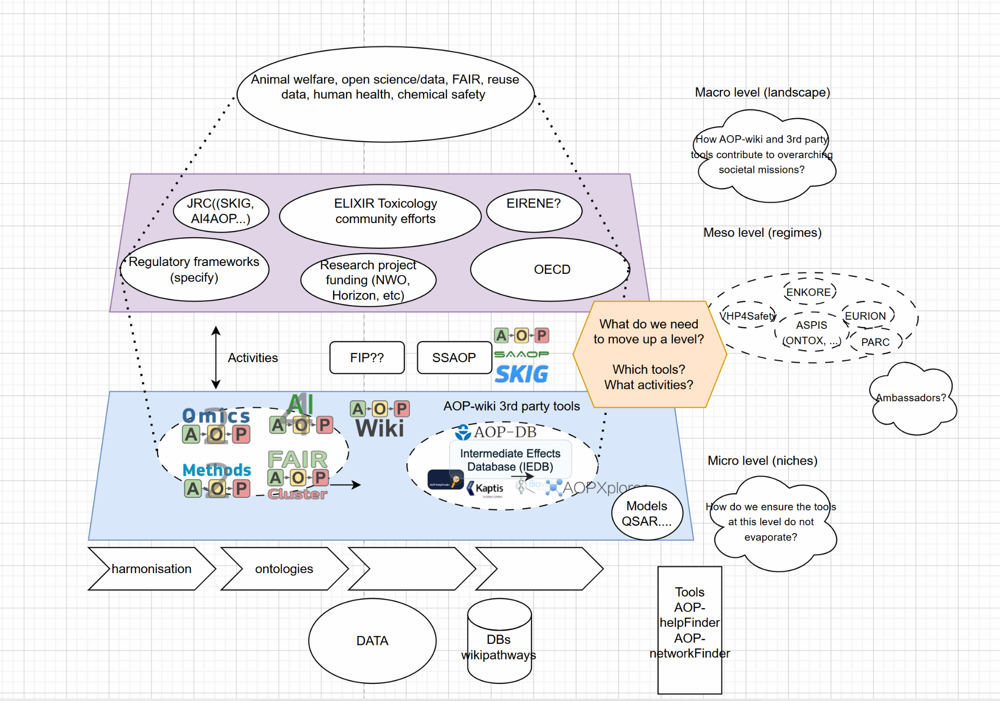

# Abstract

This report summarizes the ELIXIR Toxicology Community workshop on Systems Biology Models for Toxicology, held on 11–12 September 2025 in Athens, Greece. The workshop took place under the INTOXICOM Implementation Study workshop series (Integrating the toxicology community into ELIXIR 2024) and aimed to strengthen connections between systems biology and toxicology by bridging ELIXIR resources with systems toxicology modelling approaches used for chemical risk assessment. The workshop explored the role of qualitative and quantitative exposure–health outcome models, including (quantitative) Adverse Outcome Pathways ((q)-AOPs), AOP networks, and mechanistic toxicology models. Participants examined two use cases focused on neurotoxicity and endocrine disruption, discussing how ELIXIR tools, platforms, core data resources, and modelling environments can support them. The workshop concluded with a discussion on a roadmap for integrating ELIXIR systems biology infrastructures and tools into applied systems toxicology. This report documents the presentations, discussions, and practical results that contribute to Deliverables of INTOXICOM WP5.

# Introduction

As part of the ELIXIR Toxicology Community’s ongoing efforts to support modern, data-driven toxicology (https://elixir-europe.org/communities/toxicology), the INTOXICOM Implementation Study organized a workshop on Systems Biology Models for Toxicology. The workshop took place in Athens, Greece on 11–12 September 2025 and was preceded by a preparatory webinar.

The workshop addressed a central challenge in contemporary toxicology: how to integrate mechanistic systems biology models, multi-scale data resources, and computational tools into chemical risk assessment. Although toxicology has used mechanistic and predictive modelling approaches since the 1980s (e.g. PBPK and toxicodynamic models), the field has not yet fully leveraged the modern systems biology ecosystem available within ELIXIR Nodes.

The workshop brought together toxicologists, computational modelers, system biologists, and FAIR-oriented bioinformaticians, with the primary goals of:

* Mapping existing ELIXIR tools, services, platforms, and core data resources with potential relevance for toxicology
* Identifying systems toxicology models developed by the toxicology community that would benefit from exposure via ELIXIR infrastructures (e.g. bio.tools)
* Exploring how systems biology approaches can support qualitative and quantitative AOP development, including AOP networks
* Developing use case–driven workflows to support hazard identification and hazard potency ranking
* Constructing a roadmap for continued integration of ELIXIR infrastructure into applied systems toxicology for risk assessment

Organiser:

* Karine Audouze (FR)
* Rob Stierum (NL)

With support from:

* Marcin W. Wojewodzic (NO)
* Joost Beltman (NL)
* Chris Evelo (NL)
* ELIXIR Europe

Invited speakers:

* Holly Mortenson, US Environmental Protection Agency (EPA) & Duke University
* Ellen Hessel, RIVM, NL
* Maria Klapa, Foundation for Research & Technology - Hellas, GR
* Marvin Martens, Maastricht University

The workshop specifically targeted toxicologists with an affinity for:

* systems biology modelling
* bioinformatics
* (q)-AOP and AOP network development
* computational toxicology

# The Workshop

## Workshop Themes and Background

A modern chemical risk assessment framework requires robust and mechanistically grounded models linking chemical exposure to adverse health outcomes. Current approaches include:

* Adverse Outcome Pathways (AOPs), that is a conceptual pathway linking molecular initiating events (MIEs) to key events (KEs) that lead to adverse outcomes (AOs).
* AOP Network (AOPN), reflecting biological reality where:
    * a single stressor can lead to multiple possible outcomes
    * multiple stressors can converge on the same adverse outcome
    * toxicological responses are modulated by context, thresholds, and feedback loops
* Systems toxicology approaches that involved multi-level toxicogenomics, dynamic modelling frameworks, text mining and automatic knowledge extraction, network-based toxicology, as well as PBPK and mechanistic modelling integration.

Yet, many of these approaches still operate outside the modern systems biology tooling available within ELIXIR.

## Workshop Objectives

The workshop aimed to:

1. Identify ELIXIR systems biology tools, services, and platforms that can support toxicological modelling workflows.
2. Connect systems toxicology models with ELIXIR infrastructures, e.g. inclusion in bio.tools and connection to data standards and core data resources
3. Present two concrete use cases demonstrating how ELIXIR resources can support them.
4. Initiate a roadmap to integrate ELIXIR systems biology capabilities into toxicology.
5. Prepare for a workshop report submission to BioHackrXiv.

## Workshop Activities

A preparatory webinar was held on September 2nd, 2025. The webinar aligned participants on fundamental concepts of systems biology modelling, the AOP and qAOP frameworks, current systems toxicology modelling practices, and an overview of ELIXIR Platforms (Data, Tools, Interoperability, Compute). 

The workshop in Athens was chaired by Karine Audouze and Chris Evelo, with organizational leadership from Meike Bünger, and contributions from invited ELIXIR experts. The 11 participants were encouraged to bring along any datasets, tools, and specific questions concerning (q)-AOP modelling and the development of AOP networks.

## Presentations

The workshop began with a series of presentations establishing the landscape of systems biology in toxicology and highlighting ELIXIR resources that could support the community.

**Table 1**. Presentations delivered at the workshop

| **Speaker**     | **Title**     |
| --------------- | ------------- |
| Karine Audouze  | Presentation of ELIXIR and the toxicology community |
| Chris Evelo     | The connection between systems biology and toxicology, with BioModels established as a repository for collecting and sharing computational models |
| Ellen Hessel    | Case Study 1: Neurodevelopment |
| Karine Audouze  | Case study 2: Endocrine disruptors |
| Marvin Martens  | Molecular Pathway Modelling Standards |
| Maria Klapa     | Network analysis approaches: Fluxomics models and model standardization |
| Holly Mortensen | EU/ELIXIR services for the toxicology community with a look at harmonization across the Atlantic |

# Results

Background lectures were delivered covering topics such as the landscape of systems toxicology modeling, Adverse Outcome Pathway (AOP) and quantitative models, exposure–health outcome modeling, and the ways in which ELIXIR infrastructures can support modeling workflows. These sessions prompted discussions on the identification of relevant ELIXIR resources, including modeling environments, pathway and network resources, curated biological knowledgebases, tooling registries such as bio.tools, and compute and workflow systems.

The link between systems biology and toxicology can be strengthened through BioModels (ELIXIR), which provides a platform to collect and share computational models. However usually publications often fail to describe models in sufficient detail, frequently skipping directly to results, which undermines reproducibility. Using standardized formats such as SBML can enhance model usability outside the creator’s environment (e.g., in COPASI). Nevertheless, the availability and quality of biocuration may represent a limiting factor for broader adoption and reuse of models.

## Case Study 1: Neurodevelopment

Age and Sex specific safety: case study on thyroid mediated developmental neurotoxicity. After a brief presentation of the VHP4Safety project, the case study focused on thyroid hormone homeostasis and the role of MCT8, where deficiencies lead to imbalanced Thyroid Hormone homeostasis and from this possible intellectual and motor disabilities, making it a complex use case requiring extensive data. Silychristin serves as a known MCT8 inhibitor and is present in easily available dietary supplements such as milk thistle, warranting further (next generation) risk assessment Relevant datasets, including dietary supplement ingredients and omics data informing molecular pathways such as BDNF in brain development, were explored. Integration of quantitative and molecular AOPs was discussed, though dose information in existing RNA-seq datasets is limited. The latter is essentially, as only then quantitative exposure levels at the (presumed) MIE can be compared to external exposure scenarios (e.g. via PBK modelling). Additional data sources include in vitro thyroid cell models exposed to phthalates and population-level longitudinal datasets, such as the UK Biobank, which may provide tissue-specific and variability information on MCT8 expression. 

## Case Study 2: Systems Biology for Endocrine Disruptors

This case study highlighted the need for AI approaches to model Adverse Outcome Pathways (AOPs) due to the vast amount of scientific literature, which makes manual extraction of relevant information challenging. Tools such as AOP-helpFinder, an AI-based platform that automatically identifies and extracts AOP-related information from publications using MESH terms and other text-mining strategies, were discussed (https://aop-helpfinder-v3.u-paris-sciences.fr/) [@Jaylet2025]. Additional resources including PubTator (https://www.ncbi.nlm.nih.gov/research/pubtator3/) and PubPeer (https://pubpeer.com/), can complement the tool for capturing synonyms, aliases. Discussion about other relevant resources, such as Europe PMC were done. The EU project OBERON was mentioned as an initiative focused on integrating computational and experimental approaches to assess endocrine disruptor effects on human health. Future possibilities include text-mining project deliverables and toxicology templates to further enhance AOP modeling.

Work on use cases:

1. Hypothyroid link with glycolysis. A group of participants discussed experimental data, including rat studies that revealed sex differences and a human female cell line RNA-seq dataset showing consistent upregulation of glycolysis enzymes. The aim is to explore metabolic effects under hypothyroid condition (enzyme filtered, glycolysis and lipid metabolism
2. Project to explore AOP with glycolysis. Part of the group starts to develop AOP where glycolysis is an intermediate KE. Other participants used AOP-helpFinder to identify Key Event Relationships (KERs) from the existing literature.

Following a presentation reviewing existing international initiatives and third-party tools, a multilevel perspective was established to situate the ELIXIR-based systems toxicology efforts within a broader scientific and regulatory context. This perspective encompassed multiple layers, including data and technology considerations (e.g., FAIR/FIP principles, data harmonization), international initiatives such as AOP Wiki, relevant ELIXIR resources like BioModels and WikiPathways, ongoing national and European research projects, and societal goals such as chemical safety and the European Green Deal’s 3Rs objectives. By linking these layers, the approach aimed to integrate tools, models, and initiatives across technical, scientific, and regulatory domains (Fig. 1). The discussion highlighted potential win–win scenarios between scientific communities and existing projects, clusters and initiatives, noting that approaches and needs may differ between nanoscience and chemical science fields. 

BioModels was recognized for its strength in making curated models accessible, while the boundaries of the multilevel discussion were defined to clarify scope, distinguishing between technical aspects, ELIXIR resources, international initiatives, and ongoing research projects. A gap analysis identified missing elements, including certain community groups and additional activities that could be inventoried, with Marvin’s unpublished data serving as a concrete use case. Connections to the PARC community and OECD initiatives were emphasized, alongside FAIR AOP Cluster group and FAIR Implementation Profile (FIP) AOP considerations, to frame the big picture and guide future integration of datasets, tools, and modeling efforts.

Participants discussed strategies to refine modeling workflows, focusing on the identification of required biological and mechanistic datasets, ELIXIR resources that could be repurposed, modeling approaches including network models, dynamic models, and knowledge graphs, as well as gaps in tools, data, ontologies, and standards. This led to the initiation of a roadmap discussion aimed at integrating ELIXIR resources with applied systems toxicology (Fig. 1). Key topics included resource discovery (for example, inclusion of toxicology models in bio.tools), harmonization of modeling metadata, computational environments suitable for toxicology modeling and EU projects and initiatives. Further discussion is needed to consolidate these plans and define actionable next steps

# Outcomes

Key outcomes of the meeting included the commitment to apply AOP-helpFinder to selected case studies, with participants invited to contribute input and datasets. A standardized slide was incorporated into all EUROTOX presentations to ensure consistent communication of the initiative’s goals across INTOXICOM activities, workshops, and related efforts. The group also discussed the idea of submitting a Lorentz Center workshop application for a meeting focused on an AOP-Wiki strategic paper, with potential timelines spanning from late 2025 into 2026–2027 (https://www.lorentzcenter.nl/organize-a-workshop.html). Finally, participants agreed to publish a formal workshop report, of which this document represents the initial version.

# Discussion

The workshop demonstrated that the toxicology community is ready to move beyond narrative AOP descriptions and isolated modelling efforts toward integrated, multi-scale, mechanistic modelling workflows grounded in systems biology best practices. Participants emphasized that ELIXIR resources already provide many of the essential building blocks for advancing systems toxicology. They noted that existing toxicology models could achieve greater visibility, reuse, and long-term sustainability by being integrated within the ELIXIR infrastructure. The discussion highlighted that sustained collaboration between ELIXIR Nodes and the toxicology research community is crucial to fully realize these opportunities and strengthen the impact of systems toxicology efforts. The two use cases highlighted both the promise and the current technical gaps around model integration, workflow standardization, and cross-resource interoperability. A comment was made on the potential to link the ELIXIR-based systems toxicology work to OECD frameworks to support regulatory applications. While the workshop highlighted clear opportunities for embedding systems toxicology more deeply within the ELIXIR ecosystem, participants agreed that developing a comprehensive roadmap that includes tools, data standards, modelling frameworks, and computational infrastructure, projects & initiatives is necessary. The discussions underscored the strategic importance of such a roadmap and identified it as a priority for a future, dedicated implementation effort. This follow-up study would need to systematically assess ELIXIR resources, map them onto the requirements of applied systems toxicology, and define mechanisms for long-term integration and maintenance within ELIXIR Platforms. The workshop therefore serves as a foundation and catalyst, but the full roadmap will be developed in a subsequent, more extensive activity.

## Funding

This workshop was funded by the ELIXIR Europe INTOXICOM grant (Grant No. NL-2023-INTOXICOM).
Participants acknowledge additional project funding from related toxicology and data infrastructure initiatives. A detailed funding statement will be added upon submission following BioHackrXiv conventions.

## References

## Author contributions
